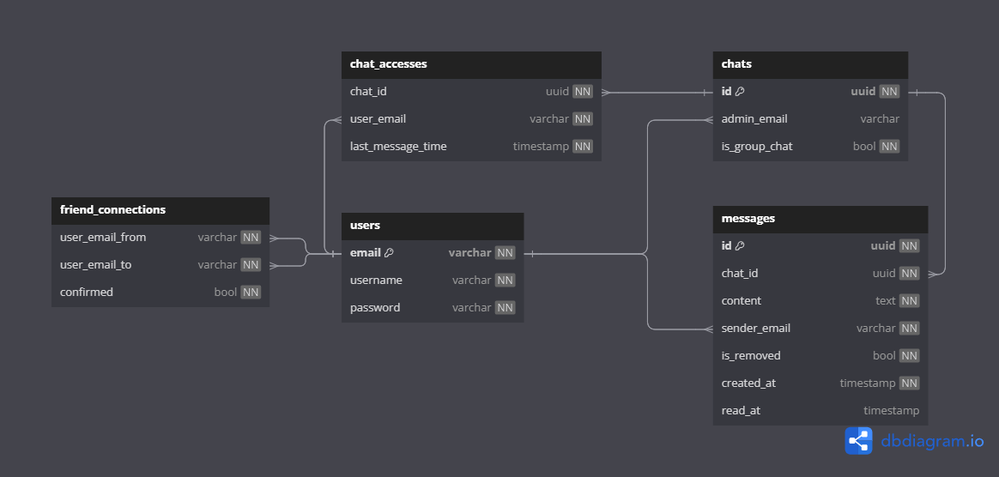

# Awe Chat

This project is my first attempt at using Golang and Next. It uses web-socket communication between clients and the server to instantly send messages. Has simple token based authentication and users can sign up using an email and password.

## Getting Started

### Server

#### Prerequisites

-   [Golang](https://go.dev/)
-   [Docker](https://www.docker.com/) or [PostgreSQL](https://www.postgresql.org/)
-   Make
-   [Migrate](https://github.com/golang-migrate/migrate)

#### Installation

1.  If you do not have make installed, please install it. For debian based systems, you can simply run the commands below.

```bash
sudo apt update
sudo apt install make
```

For windows, refer to this [discussion](https://stackoverflow.com/questions/32127524/how-to-install-and-use-make-in-windows).

If you still do not wish to install it, refer to `server/Makefile` and simply run the respective commands listed there.

2. If you do not have go-migrate installed, install it from [here](https://github.com/golang-migrate/migrate/tree/master/cmd/migrate).

3. Clone the repository and go inside the server directory.

```bash
cd server
```

4. You will need to setup a PostgreSQL database. We recommend using docker as the Makefile uses docker commands below.

```bash
make postgresinit
make createdb
```

You can also use a standalone PostgreSQL database, however you will need to change the database connection url in the link and run the commands on your own. The Makefile's command `postgresinit` and `createdb` shows how to configure a PostgreSQL database on docker.

5. After setting up the PostgreSQL database, you wll need to setup the database schema. For this you can use the Makefile's command.

```bash
make migrateup
```

6. The application's backend server should be ready now. To run it simply use

```bash
make dev
```

### Client

#### Prerequisites

-   [Node.js](https://nodejs.org/en)
-   A package manager. The app was tested with [pnpm](https://pnpm.io/installation)

#### Installation

1. Install Node.js. Download it from [here](https://nodejs.org/en/download). We recommend version 22.
2. Install a package manager. Pnpm can be downloaded by running

```bash
npm install -g @pnpm/exe
```

3. Install the dependencies using

```bash
pnpm install
```

4. The app should be ready. Run the following command

```bash
pnpm dev
```

## Technical Details

### Technologies

#### The Front-End Client

-   [Next.js](https://nextjs.org/)
-   [shadcn/ui](https://ui.shadcn.com/)
-   [Tailwindcss](https://tailwindcss.com/)
-   [React useWebSocket](https://www.npmjs.com/package/react-use-websocket) for managing websocket communication.
-   [Zod](https://zod.dev/) for validating data received from the server.

#### Back-End Server

-   Go
-   [Gin](https://gin-gonic.com/) web framework.
-   [Gorilla WebSocket](https://pkg.go.dev/github.com/gorilla/websocket) to write and read messages from the websocket connection.
-   [sqlc](https://docs.sqlc.dev/en/stable/index.html) to generate type safe interfaces for `SQL` queries.

### Database

The database handles user information and text messages. The diagram below illustrates the design.

